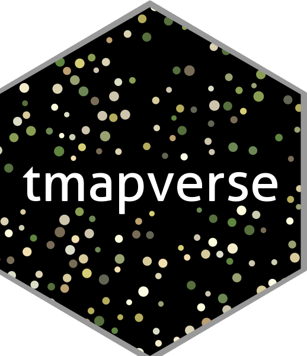
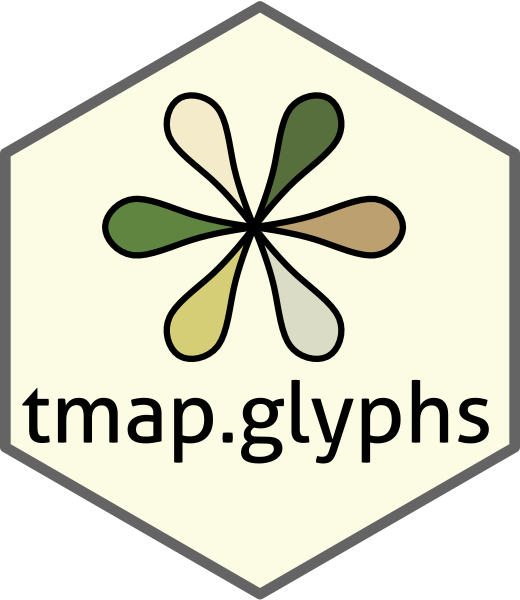
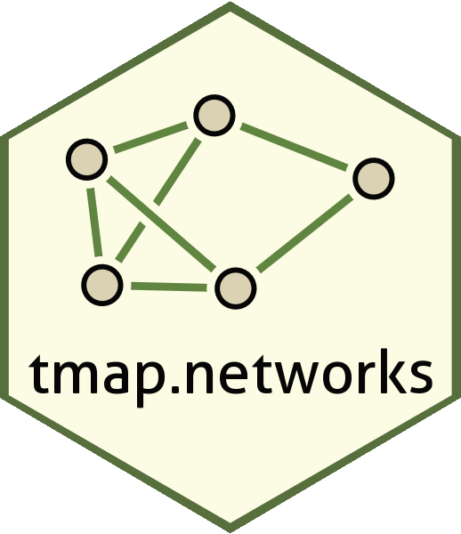
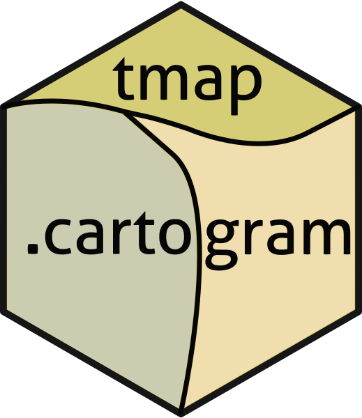
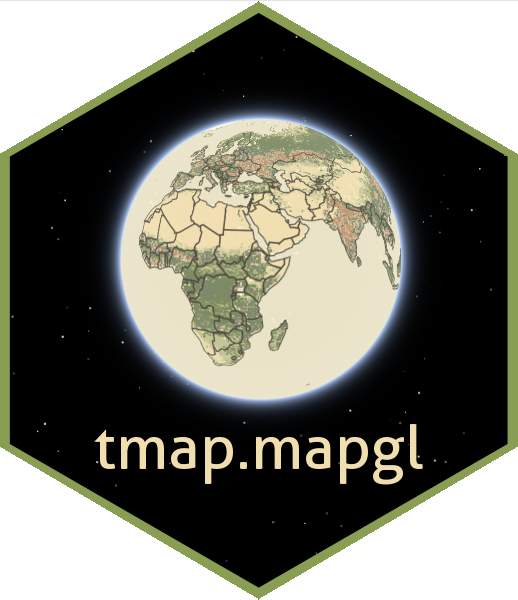

# tmapverse 

<!-- badges: start -->
[](https://cran.r-project.org/package=tmap)
[](https://cran.r-project.org/web/checks/check_results_tmap.html)
[](https://www.r-pkg.org:443/pkg/tmapverse)
[](https://www.gnu.org/licenses/gpl-3.0.html)
<!-- badges: end -->

The **tmapverse** is a meta-package that installs and attaches a curated set of packages for thematic mapping in R.  
It brings together the core **tmap** package, its extensions, and supporting spatial and color tools — providing a consistent, high-level framework for visualizing and analyzing spatial data.

---

## Packages in the tmapverse

Core package **tmap** and extension packages

| Package | Description | Logo |
|:--|:--|:--:|
| **tmap** | Core package for static and interactive thematic maps. |  |
| **tmap.glyphs** | Add glyphs (small plots) to maps. |  |
| **tmap.networks** | Visualize networks and flows on maps. |  |
| **tmap.cartogram** | Create cartograms with distorted geometries. |  |
| **tmap.mapgl** | Add interactive modes based on ‘Mapbox GL JS’ and ‘MapLibre GL JS’. |  |


Under the hood

| Package | Description | Logo |
|:--|:--|:--:|
| **sf** | Simple Features for R — standard for vector spatial data. |  |
| **stars** | Spatiotemporal arrays for raster and vector data cubes. |  |
| **terra** | Modern package for raster and vector spatial data. |  |
| **cols4all** | Explore, compare, and apply color palettes for maps. |  |

---

## tmapverse hex wall

<div style="max-width:1000px;margin:0 auto;">
  <style>
    .hex-wall { display:flex; flex-wrap:wrap; gap:12px; justify-content:center; align-items:center; padding:8px 0; }
    .hex { width:120px; height:138px; line-height:0; text-align:center; font-family: -apple-system, BlinkMacSystemFont, "Segoe UI", Roboto, "Helvetica Neue", Arial; }
    .hex svg { width:100%; height:100%; display:block; }
    .hex a { color:inherit; text-decoration:none; display:block; }
    .hex-label { display:block; margin-top:8px; font-size:13px; text-align:center; }
    /* small screens */
    @media (max-width:520px) {
      .hex { width:84px; height:97px; }
      .hex-label { font-size:11px; }
    }
  </style>

  <div class="hex-wall">

    <!-- helper: each hex is an SVG with a hex clipPath and the image placed inside; caption below. -->

    <div class="hex">
      <a href="https://r-tmap.github.io/tmapverse/">
        <svg viewBox="0 0 100 115" preserveAspectRatio="xMidYMid meet" aria-label="tmapverse">
          <defs>
            <clipPath id="hex-0"><polygon points="50 3.7 92.5 28.8 92.5 86.2 50 111.3 7.5 86.2 7.5 28.8"/></clipPath>
          </defs>
          <image clip-path="url(#hex-0)" href="man/figures/logo.png" x="0" y="0" width="100" height="115" preserveAspectRatio="xMidYMid slice"/>
          <polygon points="50 3.7 92.5 28.8 92.5 86.2 50 111.3 7.5 86.2 7.5 28.8" fill="none" stroke="rgba(0,0,0,0.06)"/>
        </svg>
      </a>
      <span class="hex-label">tmapverse</span>
    </div>

    <div class="hex">
      <a href="https://r-tmap.github.io/tmap/">
        <svg viewBox="0 0 100 115" preserveAspectRatio="xMidYMid meet" aria-label="tmap">
          <defs><clipPath id="hex-1"><polygon points="50 3.7 92.5 28.8 92.5 86.2 50 111.3 7.5 86.2 7.5 28.8"/></clipPath></defs>
          <image clip-path="url(#hex-1)" href="man/figures/tmap.png" x="0" y="0" width="100" height="115" preserveAspectRatio="xMidYMid slice"/>
          <polygon points="50 3.7 92.5 28.8 92.5 86.2 50 111.3 7.5 86.2 7.5 28.8" fill="none" stroke="rgba(0,0,0,0.06)"/>
        </svg>
      </a>
      <span class="hex-label">tmap</span>
    </div>

    <div class="hex">
      <a href="https://r-tmap.github.io/tmap.glyphs/">
        <svg viewBox="0 0 100 115" preserveAspectRatio="xMidYMid meet" aria-label="tmap.glyphs">
          <defs><clipPath id="hex-2"><polygon points="50 3.7 92.5 28.8 92.5 86.2 50 111.3 7.5 86.2 7.5 28.8"/></clipPath></defs>
          <image clip-path="url(#hex-2)" href="man/figures/tmap_glpyhs.png" x="0" y="0" width="100" height="115" preserveAspectRatio="xMidYMid slice"/>
          <polygon points="50 3.7 92.5 28.8 92.5 86.2 50 111.3 7.5 86.2 7.5 28.8" fill="none" stroke="rgba(0,0,0,0.06)"/>
        </svg>
      </a>
      <span class="hex-label">tmap.glyphs</span>
    </div>

    <div class="hex">
      <a href="https://r-tmap.github.io/tmap.networks/">
        <svg viewBox="0 0 100 115" preserveAspectRatio="xMidYMid meet" aria-label="tmap.networks">
          <defs><clipPath id="hex-3"><polygon points="50 3.7 92.5 28.8 92.5 86.2 50 111.3 7.5 86.2 7.5 28.8"/></clipPath></defs>
          <image clip-path="url(#hex-3)" href="man/figures/tmap_networks_hex2.png" x="0" y="0" width="100" height="115" preserveAspectRatio="xMidYMid slice"/>
          <polygon points="50 3.7 92.5 28.8 92.5 86.2 50 111.3 7.5 86.2 7.5 28.8" fill="none" stroke="rgba(0,0,0,0.06)"/>
        </svg>
      </a>
      <span class="hex-label">tmap.networks</span>
    </div>

    <div class="hex">
      <a href="https://r-tmap.github.io/tmap.cartogram/">
        <svg viewBox="0 0 100 115" preserveAspectRatio="xMidYMid meet" aria-label="tmap.cartogram">
          <defs><clipPath id="hex-4"><polygon points="50 3.7 92.5 28.8 92.5 86.2 50 111.3 7.5 86.2 7.5 28.8"/></clipPath></defs>
          <image clip-path="url(#hex-4)" href="man/figures/tmap_cartogram.png" x="0" y="0" width="100" height="115" preserveAspectRatio="xMidYMid slice"/>
          <polygon points="50 3.7 92.5 28.8 92.5 86.2 50 111.3 7.5 86.2 7.5 28.8" fill="none" stroke="rgba(0,0,0,0.06)"/>
        </svg>
      </a>
      <span class="hex-label">tmap.cartogram</span>
    </div>

    <div class="hex">
      <a href="https://r-tmap.github.io/tmap.mapgl/">
        <svg viewBox="0 0 100 115" preserveAspectRatio="xMidYMid meet" aria-label="tmap.mapgl">
          <defs><clipPath id="hex-5"><polygon points="50 3.7 92.5 28.8 92.5 86.2 50 111.3 7.5 86.2 7.5 28.8"/></clipPath></defs>
          <image clip-path="url(#hex-5)" href="man/figures/tmap_mapgl2.png" x="0" y="0" width="100" height="115" preserveAspectRatio="xMidYMid slice"/>
          <polygon points="50 3.7 92.5 28.8 92.5 86.2 50 111.3 7.5 86.2 7.5 28.8" fill="none" stroke="rgba(0,0,0,0.06)"/>
        </svg>
      </a>
      <span class="hex-label">tmap.mapgl</span>
    </div>

    <div class="hex">
      <a href="https://r-spatial.github.io/sf/">
        <svg viewBox="0 0 100 115" preserveAspectRatio="xMidYMid meet" aria-label="sf">
          <defs><clipPath id="hex-6"><polygon points="50 3.7 92.5 28.8 92.5 86.2 50 111.3 7.5 86.2 7.5 28.8"/></clipPath></defs>
          <image clip-path="url(#hex-6)" href="man/figures/sf.png" x="0" y="0" width="100" height="115" preserveAspectRatio="xMidYMid slice"/>
          <polygon points="50 3.7 92.5 28.8 92.5 86.2 50 111.3 7.5 86.2 7.5 28.8" fill="none" stroke="rgba(0,0,0,0.06)"/>
        </svg>
      </a>
      <span class="hex-label">sf</span>
    </div>

    <div class="hex">
      <a href="https://r-tmap.github.io/stars/">
        <svg viewBox="0 0 100 115" preserveAspectRatio="xMidYMid meet" aria-label="stars">
          <defs><clipPath id="hex-7"><polygon points="50 3.7 92.5 28.8 92.5 86.2 50 111.3 7.5 86.2 7.5 28.8"/></clipPath></defs>
          <image clip-path="url(#hex-7)" href="man/figures/stars.png" x="0" y="0" width="100" height="115" preserveAspectRatio="xMidYMid slice"/>
          <polygon points="50 3.7 92.5 28.8 92.5 86.2 50 111.3 7.5 86.2 7.5 28.8" fill="none" stroke="rgba(0,0,0,0.06)"/>
        </svg>
      </a>
      <span class="hex-label">stars</span>
    </div>

    <div class="hex">
      <a href="https://rspatial.github.io/terra/">
        <svg viewBox="0 0 100 115" preserveAspectRatio="xMidYMid meet" aria-label="terra">
          <defs><clipPath id="hex-8"><polygon points="50 3.7 92.5 28.8 92.5 86.2 50 111.3 7.5 86.2 7.5 28.8"/></clipPath></defs>
          <image clip-path="url(#hex-8)" href="man/figures/terra.png" x="0" y="0" width="100" height="115" preserveAspectRatio="xMidYMid slice"/>
          <polygon points="50 3.7 92.5 28.8 92.5 86.2 50 111.3 7.5 86.2 7.5 28.8" fill="none" stroke="rgba(0,0,0,0.06)"/>
        </svg>
      </a>
      <span class="hex-label">terra</span>
    </div>

    <div class="hex">
      <a href="https://r-tmap.github.io/cols4all/">
        <svg viewBox="0 0 100 115" preserveAspectRatio="xMidYMid meet" aria-label="cols4all">
          <defs><clipPath id="hex-9"><polygon points="50 3.7 92.5 28.8 92.5 86.2 50 111.3 7.5 86.2 7.5 28.8"/></clipPath></defs>
          <image clip-path="url(#hex-9)" href="man/figures/cols4all.png" x="0" y="0" width="100" height="115" preserveAspectRatio="xMidYMid slice"/>
          <polygon points="50 3.7 92.5 28.8 92.5 86.2 50 111.3 7.5 86.2 7.5 28.8" fill="none" stroke="rgba(0,0,0,0.06)"/>
        </svg>
      </a>
      <span class="hex-label">cols4all</span>
    </div>

  </div>
</div>

## Installation

Installation of **tmapverse** is straightforward:

```r
install.packages("tmapverse")
```

Install the development version from GitHub:

```r
# install.packages("remotes")
remotes::install_github("r-tmap/tmapverse")
```
